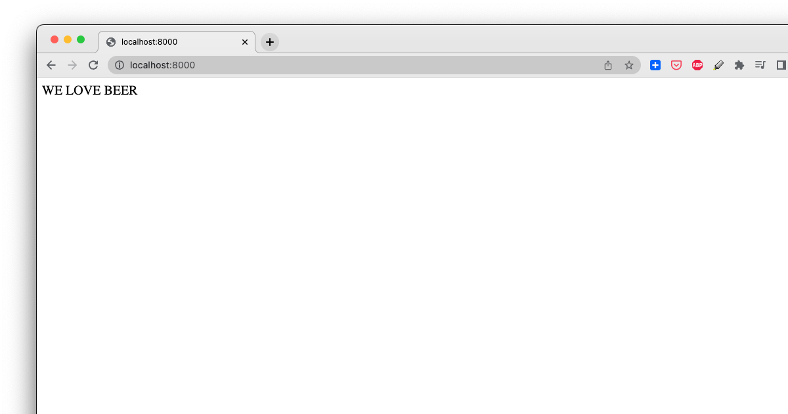
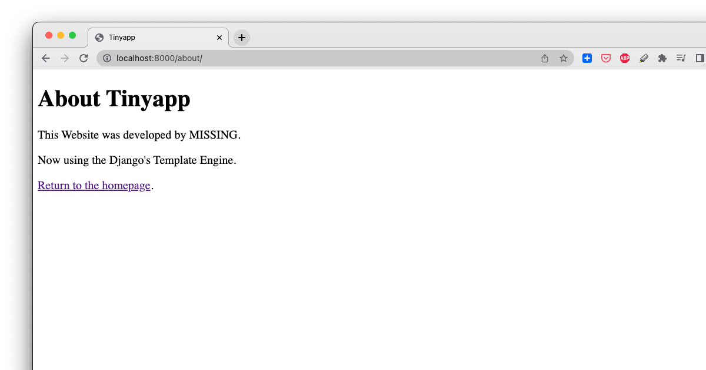
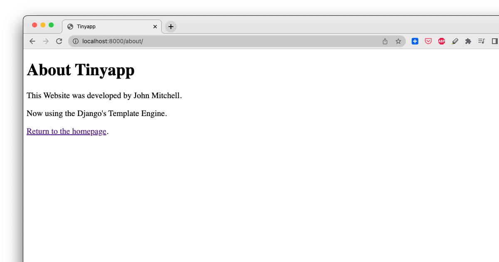

So the other day I wanted to make a small web app. Django is a great framework for this, as it automatically includes a ton of stuff I know I'll need. A database, templates, routing, all the "batteries included" features I like. 

I found a [blog post](https://realpython.com/django-todo-lists/) that shows how to do a "Todo" app in full Django style. I copied the code, and at the end my app worked! Unfortunately, it was a bit confusing. The code had many files, 640 lines of code, and six nearly-identical directories. If a page template is put in the wrong spot, the app explodes. The structure was easy to get wrong, so I was spending energy on minutia vs getting my project done.

There's a simpler way to create an app.

The "Todo" app from the article had too many moving parts, so I chose to do a minimal app next time. I found another [blog post, by Vitor Freitas](https://simpleisbetterthancomplex.com/article/2017/08/07/a-minimal-django-application.html).  This one was much better: only 56 lines of code! Despite not being as featureful, this minimal app has most of the features I want: templates, URL routing, and convenience features. At 10% of the complexity, I'm happy with this.

Let me show you how to do it.

## Benefits of a Minimal Application

I'm a fan of feedback loops -- I'm writing a book on the subject. In building my app, I want to have a tiny core of code that I know very well. Over time, I'll add a small feature, then integrate and publish the updated app. A fast quality feedback loop, where I trust everything, is really useful.

By having a strong base for the app, then add things in small iterations, we get a solid feedback loop. Any time something breaks, we find out about immediately and it's very easy to fix.

The standard Todo App was okay, but had 10x the amount of code as the Minimal app, and *22* files in *six* different directories. If a template is in the wrong place, loading a page will make the app explode with a really ugly error. Not fun, and not conducive to a tight, fast feedback loop.

The Minimal App only has *two* directories. It's incredibly easy to just add code and it works, vs having to manage fiddly details that don't contribute to my app.

## Minimal Django App

The standard `django-admin startproject` command generates a basic Django project directory structure with a number of files... but they're mostly extra boilerplate. We'll dispense with all of that.

Let's write a minimal Django app from scratch.

### Setup virtualenv

    python3 -m venv venv
    source venv/bin/activate
    pip install -r requirements.txt

### Write One-File Django Project

Copy this code into `tinyapp.py`, in the top-level project directory.

    from django.urls import re_path
    from django.http import HttpResponse

    DEBUG = True
    SECRET_KEY = '1234'
    ROOT_URLCONF = __name__

    def home(request):
        return HttpResponse("WE LOVE BEER")

    urlpatterns = [
        re_path(r'^$', home, name='homepage'),
    ]

### Run App

Run the Django appserver:

    django-admin runserver --pythonpath=. --settings=tinyapp

### Verify App

Load the web page in a browser http://localhost:8000/



We're done! A fully working minimal Django app in *ten* lines of code. The traditional settings.py file from the standard boilerplate is easily quadruple that.

Currently the page text is hardcoded in the Python code, so it's hard to edit.

Let's add a feature: render page using a template.

## Minimal Django with Template

An HTML page hardcoded on the server is awkward to edit, track, and manage. Put the page in a separate file, and let its details be set in code.

To build a tight, fast feedback loop, we want to make small changes and immediately see if they work. Since it's been a while since I built with Django, I wanted to verify my assumptions at multiple levels:

* _server_ functions work: create a 2nd page, have the 1st one redirect to it. E.g. use the `redirect()` Django function
* templates work: Django correctly found in the "templates" directory 
* template _values_ are rendering correctly - `title` is given in the server and will show in the page
* template _functions_ work - `author` is not given in the server, so "MISSING" will show on the page

The following change tests multiple things at the same time. Based on the output, we can diagnose whatever's doing wrong, fix it, and move on.

Let's also experiment with Django by creating another page, and having the main home page redirect to it.

### update Tinyapp to use Jinja Template

Replace the tinyapp.py file with this code:


    from django.urls import re_path
    from django.shortcuts import redirect, render as django_render

    DEBUG = True
    SECRET_KEY = '1234'
    ROOT_URLCONF = __name__
    TEMPLATES = [
        {
            'BACKEND': 'django.template.backends.django.DjangoTemplates',
            'DIRS': [
                'templates/'
            ],
        },
    ]


    def about(request):
        title = 'Tinyapp'
        # NOTE: `author` not specified yet
        return django_render(request, 'about.html', locals())


    def home(request):
        return redirect('aboutpage')


    urlpatterns = [
        re_path(r'^$', home, name='homepage'),
        re_path(r'^about/$', about, name='aboutpage'),
    ]

### Create the Template

Make the "templates" directory and put a HTML template inside:

    mkdir templates

Create the `about.html` page in the `templates` directory:

templates/about.html:

    <!DOCTYPE html>
    <html>
    <head>
    <title>{{ title }}</title>
    </head>
    <body>
    <h1>About {{ title }}</h1>
    <p>This Website was developed by {{ author | default:"MISSING"}}.</p>
    <p>Now using the Django's Template Engine.</p>
    <p><a href="">Return to the homepage</a>.</p>
    </body>
    </html>

### Verify the Template Works

    django-admin runserver --pythonpath=. --settings=tinyapp

Open the app in a browser: http://localhost:8000/



It works!

Note:
- the `home()` page correctly redirected to the About page -- the URL in the browser was changed to `http://localhost:8000/about/`
- since our `about()` page didn't specify all the values -- the `author` was missing -- the template renders as "was developed by MISSING" -- which is correct. Our template functions work!

The Python code is a little rough. Can we improve it? Each page function can calculate values, then just return them. The page template ID doesn't change much, so we can hardcode that in a function wrapper.

## Minimal Django with Template and Simpler View Functions

In our real app we want to calculate some values, then use a pre-defined template to render them. Values are specified in code, and the wrapper template page will be set as a Python annotation.

Add this to the tinyapp.py:

    # wrapper renders django template
    def render(template_name):
        def decorator(func):
            def wrapper(request, *args, **kwargs):
                context = func(request, *args, **kwargs)
                return django_render(request, template_name, context)
            return wrapper
        return decorator

Lets test this "render as template" wrapper, and specify an `author` value this time. Replace the `about` function with this code:

```python
@render(template_name='about.html')
def about(request):
    title = 'Tinyapp'
    author = 'John Mitchell'
    return locals()
```


### Verify Template Works

    django-admin runserver --pythonpath=. --settings=tinyapp

Open the app in a browser: http://localhost:8000/

It works!



## Conclusion

We've built a tiny app in Django and added several features, all in < 60 lines of code! We've used a number of Django features used in real apps: templates, redirection, custom filters, and server-side simplification.


## Future Directions

* the Todo app noted below is very useful for real-world Django projects. It uses a database, and shows off Django-specific features missing from "tinyapp".
* check the GitHub repos for extra goodies. The Makefile has a lot of real-world Developer workflow things, like using the Ruff linter for fast code-level feedback. The repos also contains a Dockerfile for publishing your app in Docker as a container, or AWS App Runner for hosting on the internet.
  
## Thanks

* Vitor Freitas, for [A Minimal Django Application](https://simpleisbetterthancomplex.com/article/2017/08/07/a-minimal-django-application.html), which this Tinyapp is heavily based. Go read this article, it's very clear and direct.

* Charles de Villiers, for writing [Manage Your To-Do Lists Using Python and Django](https://realpython.com/django-todo-lists/)  Any real-world app will use most of the ideas from this project.

